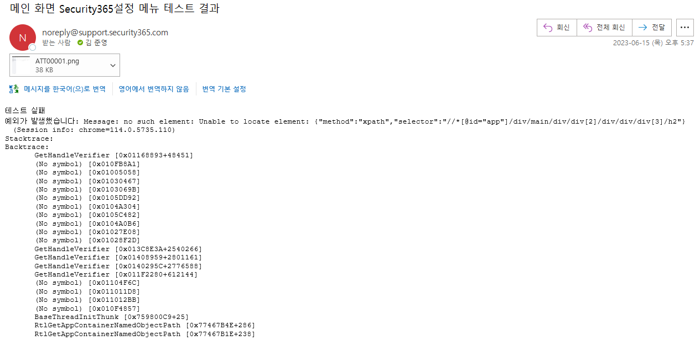

### 코드 정보

샘플 코드 정보

<table>
  <thead>
    <tr>
      <th>No</th>
      <th>제목</th>
      <th>내용</th>
      <th>비고</th>
    </tr>
  </thead>
  <tbody>
    <tr>
      <td>1</td>
      <td>사용 언어</td>
      <td>Python(v 3.10.4)</td>
      <td>pip install selenium==4.1.4 <br /> pip install chromedriver-autoinstaller</td>
    </tr>
    <tr>
      <td>2</td>
      <td>Web Driver</td>
      <td>Chromedriver - 114.0.5735.110(실행할 서버와 동일한 Web Driver를 사용해야함)</td>
      <td>chromedriver-autoinstaller을 통해 자동 설치</td>
    </tr>
    <tr>
      <td>3</td>
      <td>Git Repos</td>
      <td>프로젝트 : Test Project <br /> 리포지토리 : Selenium_Test <br /> 링크 : https://dev.azure.com/Security365/Test%20Project/_git/Selenium_Test?path=/selenium_test_Portal_Login.py </td>
      <td></td>
    </tr>
    <tr>
      <td>4</td>
      <td>Step</td>
      <td>1. Portal 로그인 화면으로 이동 <br /> 2. MS 로그인 <br /> 3. 관리센터 메인화면 체크 <br /> 4. 사용자 관리 페이지 이동 <br /> 5. 사용자 추가 기능 검증 <br /> 6. Step 별 결과 메일 발송</td>
      <td></td>
    </tr>
    <tr>
      <td>5</td>
      <td>전제 조건</td>
      <td>정적 XPath(XML Path Language)로 맵핑하여 진행 <br /> → XPath 값이 실행할 때 마다 바뀔수 있기 때문에 추후 Class ID 등으로 맵핑하는 작업 필요 </td>
      <td></td>
    </tr>
  </tbody>
</table>

### Sample Code
* Sample Code

:::note 설명

* 로컬에서 구동 시 "#헤드리스 적용 옵션"을 주석처리하고 "#크롬드라이버 자동 설치" 를 사용하여 웹 드라이버를 자동설치한다.
* Pipeline에서 구동 시 "#헤드리스 적용 옵션"을 사용하고 "#크롬드라이버 자동 설치" 를 주석 처리한다.
:::

<details>
  <summary>Sample Code</summary>
  <div>
    <div>selenium_test_Portal_Login.py</div>
    <br/>
    <details>

```python
import imp
import selenium
import logging
import time
import SendMail
import chromedriver_autoinstaller

#os.path.isdir(path): //경로안에

from selenium import webdriver
from selenium.webdriver.chrome.options import Options
from selenium.common.exceptions import NoSuchElementException
from selenium.webdriver.common.keys import Keys
from selenium.webdriver.common.by import By
from selenium.webdriver.chrome.service import Service
logging.basicConfig(level=logging.INFO)

#헤드리스 적용 옵션
options = Options()
options.add_argument('--headless=new')

''''
#크롬드라이버 자동 설치driver
print('chromedriver_autoinstaller 실행')
chrome_ver = chromedriver_autoinstaller.get_chrome_version().split('.')[0]  #크롬드라이버 버전 확인
driver_path = f'./{chrome_ver}/chromedriver'


try:
    service = Service(driver_path)
    driver = webdriver.Chrome(service=service, options=options)   
except:
    chromedriver_autoinstaller.install(True)
    service = Service(driver_path)
    driver = webdriver.Chrome(service=service, options=options)

driver.implicitly_wait(10)
'''
#Portal 로그인
driver = webdriver.Chrome(options=options)
url = 'https://staportal.security365.com'
driver.get(url)
driver.implicitly_wait(10)
#MS로 로그인하기 버튼 클릭
try:
    driver.find_element(By.ID, 'ms_login').click()
except Exception as e:
    logging.error("로그인 테스트 실패" + f"\n예외가 발생했습니다: {str(e)}")
    driver.save_screenshot('screenshot.png')
    #SendMail.send_email('로그인 테스트 결과', '테스트 실패' + f'\n예외가 발생했습니다: {str(e)}', 'screenshot.png')
    driver.quit()    
time.sleep(3)
#MS 로그인 창 ID/PW 입력
last_tab = driver.window_handles[-1]
driver._switch_to.window(window_name=last_tab)
try:
    "사용자 계정 로그인" in driver.title
    logging.info("로그인 UI 테스트 성공")
except Exception as e:
    logging.error("로그인 UI 테스트 실패" + f"\n예외가 발생했습니다: {str(e)}")
    driver.save_screenshot('screenshot.png')
    #SendMail.send_email('로그인 UI 테스트 결과', '테스트 실패' + f'\n예외가 발생했습니다: {str(e)}', 'screenshot.png')
    driver.quit()
time.sleep(2)    
driver.find_element_by_xpath('//*[@id="i0116"]').send_keys('iadmin@softcamp3.onmicrosoft.com')
driver.find_element_by_id('idSIButton9').click()
time.sleep(2)
driver.find_element_by_xpath('//*[@id="i0118"]').send_keys('socam2021!3')
driver.find_element_by_xpath('//*[@id="idSIButton9"]').click()
time.sleep(3)
driver.find_element_by_xpath('//*[@id="idBtn_Back"]').click()
#Portal 창으로 이동
time.sleep(3)
first_tab = driver.window_handles[0]
driver.switch_to.window(window_name=first_tab)
#테스트 성공/실패 여부 체크(로그)
time.sleep(3)
if driver.current_url == "https://staportal.security365.com/admin":
    logging.info("Portal 로그인 테스트 성공")
    #SendMail.send_email('Portal 로그인 테스트 결과', '테스트 성공')
elif driver.current_url == "https://staportal.security365.com/bridge/error?type=tenant":
    logging.error("Portal 로그인 테스트 실패")
    driver.save_screenshot('screenshot.png')
    #SendMail.send_email('Portal 로그인 테스트 결과', '테스트 실패', 'screenshot.png')
    raise
else:
    logging.error("Portal 로그인 테스트 실패")
    driver.save_screenshot('screenshot.png')
    #SendMail.send_email('Portal 로그인 테스트 결과', '테스트 실패', 'screenshot.png')
    raise
#------------------------------------------------------------------------------------------------

#Portal 메인화면
#Security365 LNB 메뉴 체크
time.sleep(3)
try:
    driver.find_element_by_xpath('//*[@id="app"]/div/main/div/div[2]/div/div/div[3]/h2')
    logging.info("메인 화면 Security365 LNB 메뉴 체크 테스트 성공")
except Exception as e:
    logging.error("메인 화면 Security365 LNB 메뉴 체크 테스트 실패" + f"\n예외가 발생했습니다: {str(e)}")
    driver.save_screenshot('screenshot.png')
    #SendMail.send_email('메인 화면 Security365 LNB 메뉴 테스트 결과', '테스트 실패'+ f'\n예외가 발생했습니다: {str(e)}', 'screenshot.png')
    driver.quit()
    raise
#Security365현황 체크
try:
    driver.find_element_by_xpath('//*[@id="app"]/div/main/div/div[2]/div/div/div[3]/div/h3')
    logging.info("메인 화면 Security365 현황 메뉴 체크 테스트 성공")
except Exception as e:
    logging.error("메인 화면 Security365 현황 메뉴 체크 테스트 실패" + f"\n예외가 발생했습니다: {str(e)}")
    driver.save_screenshot('screenshot.png')
    #SendMail.send_email('Security365현황 테스트 결과', '테스트 실패' + f'\n예외가 발생했습니다: {str(e)}', 'screenshot.png')
    driver.quit()
    raise
#------------------------------------------------------------------------------------------------
        
#LNB 사용자 관리 메뉴 이동
driver.find_element_by_xpath('//*[@id="app"]/div/aside/div[1]/div/div[2]/div[2]/div').click()
time.sleep(3)
try:
    driver.find_element_by_xpath('//*[@id="app"]/div/main/div/div[2]/div/h1')
    logging.info("LNB 사용자 관리 메뉴 테스트 성공")
except Exception as e:
    logging.error("LNB 사용자 관리 메뉴 테스트 실패")
    driver.save_screenshot('screenshot.png')
    #SendMail.send_email('LNB 사용자 관리 메뉴 테스트 결과', '테스트 실패' + f'\n예외가 발생했습니다: {str(e)}', 'screenshot.png')
    driver.quit()
    raise
#사용자 추가 버튼 클릭
driver.find_element_by_xpath('//*[@id="app"]/div/main/div/div[2]/div/div/div[1]/button[1]').click()
time.sleep(3)
try:
    driver.find_element_by_xpath('//*[@id="app"]/div[3]/div/div[1]/h1')
    logging.info("LNB 사용자 추가 메뉴 테스트 성공")
except Exception as e:
    logging.error("LNB 사용자 추가 메뉴 테스트 실패")
    driver.save_screenshot('screenshot.png')
    #SendMail.send_email('LNB 사용자 추가 메뉴 테스트 결과', '테스트 실패' + f'\n예외가 발생했습니다: {str(e)}', 'screenshot.png')
    driver.quit()
    raise
#사용자 등록(단일 사용자) 버튼 클릭
driver.find_element_by_xpath('//*[@id="app"]/div[3]/div/div[2]/ul/li[1]').click()
time.sleep(3)
try:
    driver.find_element_by_xpath('//*[@id="app"]/div[4]/div/div[1]/h1')
    logging.info("LNB 사용자 등록 메뉴 테스트 성공")
except Exception as e:
    logging.error("LNB 사용자 등록 메뉴 테스트 실패")
    driver.save_screenshot('screenshot.png')
    #SendMail.send_email('LNB 사용자 등록 메뉴 테스트 결과', '테스트 실패' + f'\n예외가 발생했습니다: {str(e)}', 'screenshot.png')
    driver.quit()
    raise
time.sleep(2)
#사용자 정보 입력//*[@id="app"]/div[4]/div/div[2]/form/div[1]/div[1]/div[2]/div/div[1]/div
try:
    driver.find_element_by_xpath('//*[@id="input-200"]').send_keys('test')
except Exception as e:
    logging.error("LNB 사용자 등록 테스트 실패")
    driver.save_screenshot('screenshot.png')
    #SendMail.send_email('LNB 사용자 등록 테스트 실패', '테스트 실패' + f'\n예외가 발생했습니다: {str(e)}', 'screenshot.png')
    #driver.quit()
    raise
try:    
    driver.find_element_by_xpath('//*[@id="input-204"]').send_keys('입니다')
except Exception as e:
    logging.error("LNB 사용자 등록 테스트 실패")
    driver.save_screenshot('screenshot.png')
    #SendMail.send_email('LNB 사용자 등록 테스트 실패', '테스트 실패' + f'\n예외가 발생했습니다: {str(e)}', 'screenshot.png')
    driver.quit()
    raise
try:    
    driver.find_element_by_xpath('//*[@id="input-208"]').send_keys('test@.test.co')    
except Exception as e:
    logging.error("LNB 사용자 등록 테스트 실패")
    driver.save_screenshot('screenshot.png')
    #SendMail.send_email('LNB 사용자 등록 테스트 실패', '테스트 실패' + f'\n예외가 발생했습니다: {str(e)}', 'screenshot.png')
    driver.quit()
    raise
time.sleep(1)
#완료 버튼 클릭(클릭 성공 시 성공)
try:
    element = driver.find_element_by_xpath('//*[@id="app"]/div[4]/div/div[3]/button[2]/span')
    element.click()
    logging.info("LNB 사용자 등록 테스트 성공")
except Exception as e:
    logging.error("LNB 사용자 등록 테스트 실패")
    driver.save_screenshot('screenshot.png')
    #SendMail.send_email('LNB 사용자 등록 테스트 결과', '테스트 실패' + f'\n예외가 발생했습니다: {str(e)}', 'screenshot.png')
    driver.quit()
    raise
#------------------------------------------------------------------------------------------------
time.sleep(5)
# 검색 입력 상자를 찾고 검색어를 입력합니다.
search_box = driver.find_element_by_xpath('//*[@id="input-115"]')
search_box.send_keys('test' + Keys.RETURN)
time.sleep(5)
# 페이지에서 "test@.test.co"이라는 텍스트가 있는지 확인합니다.
try:
    "test@.test.co" in driver.page_source
    logging.info("추가된 사용자 검색 테스트 성공")
except Exception as e:
    logging.error("추가된 사용자 검색 테스트 실패")
    driver.save_screenshot('screenshot.png')
    #SendMail.send_email('추가된 사용자 검색 테스트 결과', '테스트 실패' + f'\n예외가 발생했습니다: {str(e)}', 'screenshot.png')
    driver.quit()
    raise
#------------------------------------------------------------------------------------------------
```
</details>
  </div>
</details>

* 메일 발송 샘플

<details>
  <summary>메일 발송 샘플</summary>
  <div>
    <div>SendMail.py</div>
    <br/>
    <details>

```python
import smtplib
from email.mime.multipart import MIMEMultipart
from email.mime.text import MIMEText
from email.mime.image import MIMEImage
 
def send_email(subject, body, screenshot_path=None):
    smtp_server = '10.10.200.27'  # SMTP 서버 주소
    smtp_port = 25  # SMTP 서버 포트
    smtp_username = 'noreply@support.security365.com'  # SMTP 계정 아이디
    smtp_password = 'socam2021@'  # SMTP 계정 패스워드
    from_email = 'noreply@support.security365.com'  # 보내는 사람 이메일 주소
    to_email = 'junyoung.kim@softcamp.co.kr'  # 받는 사람 이메일 주소
 
    msg = MIMEMultipart()  # 이메일 내용
    msg['Subject'] = subject  # 이메일 제목
    msg['From'] = from_email  # 보내는 사람 이메일 주소
    msg['To'] = to_email  # 받는 사람 이메일 주소
 
    text = MIMEText(body, 'plain')
    msg.attach(text)   
 
    # 스크린샷 추가
    if screenshot_path:
        with open(screenshot_path, 'rb') as f:
            image = MIMEImage(f.read())
        msg.attach(image)
 
    with smtplib.SMTP(smtp_server, smtp_port) as smtp:
        smtp.ehlo()
        #smtp.starttls()
        smtp.login(smtp_username, smtp_password)
        smtp.send_message(msg)
```
</details>
  </div>
</details>

### 결과 예시
:::note 설명

* 실패하거나 성공한 Step 명을 메일 제목으로 넣어 구별
* 자동화 테스트 실패 시 발생한 Selenium 로그와 실패한 UI화면 이미지로 첨부
:::



### 코드리스
:::note 설명

* 코드를 직접 작성하지 않고 Tool을 사용해 자동화 테스트 코드를 자동으로 구현해주는 기능이 있음
* 디테일한 코드 작업을 위해 수동으로 가공이 필요한 경우가 존재
* 다양한 코드리스 Tool이 존재하여 필요에 맞게 선택하여 사용 가능
:::

1. Selenium-IDE 사용 방법(무료)
크롬 확장 기능을 통해 플러그인형태로 사용가능
→ 시크릿 브라우저가 아닌 일반 브라우저로 실행되는 문제가 있음

참고자료
https://www.bangseongbeom.com/selenium-ide-guide.html

https://www.selenium.dev/selenium-ide/docs/en/plugins/plugins-getting-started

* 사용 예시

  사용자는 UI Click 및 텍스트 입력을 통해 자동화 테스트를 구현할 수 있습니다.

* Export 기능

  원하는 언어에 맞게 선택하면 선택한 언어로 자동화 코드를 Export 할 수 있습니다.


* 샘플 코드

<details>
  <summary>파이썬 샘플 코드</summary>
  <div>
    <div>test_portal2.py</div>
    <br/>
    <details>

```python
# Generated by Selenium IDE
import pytest
import time
import json
from selenium import webdriver
from selenium.webdriver.common.by import By
from selenium.webdriver.common.action_chains import ActionChains
from selenium.webdriver.support import expected_conditions
from selenium.webdriver.support.wait import WebDriverWait
from selenium.webdriver.common.keys import Keys
from selenium.webdriver.common.desired_capabilities import DesiredCapabilities

class TestPortal():
  def setup_method(self, method):
    self.driver = webdriver.Chrome()
    self.vars = {}
  
  def teardown_method(self, method):
    self.driver.quit()
  
  def wait_for_window(self, timeout = 2):
    time.sleep(round(timeout / 1000))
    wh_now = self.driver.window_handles
    wh_then = self.vars["window_handles"]
    if len(wh_now) > len(wh_then):
      return set(wh_now).difference(set(wh_then)).pop()
  
  def test_(self):
    # Test name: 로그인
    # Step # | name | target | value
    # 1 | open | https://stalogin.security365.com/SCCloudOAuthService/authLogin?clientName=SPSVR&redirect_uri=https://staspsvr.security365.com/api/callbacks/security365/code&redirect= | 
    self.driver.get("https://stalogin.security365.com/SCCloudOAuthService/authLogin?clientName=SPSVR&redirect_uri=https://staspsvr.security365.com/api/callbacks/security365/code&redirect=")
    # 2 | setWindowSize | 1407x835 | 
    self.driver.set_window_size(1407, 835)
    # 3 | click | css=.card:nth-child(1) > .social-login-inner span | 
    self.vars["window_handles"] = self.driver.window_handles
    # 4 | storeWindowHandle | root | 
    self.driver.find_element(By.CSS_SELECTOR, ".card:nth-child(1) > .social-login-inner span").click()
    # 5 | selectWindow | handle=${win4727} | 
    self.vars["win4727"] = self.wait_for_window(2000)
    # 6 | click | id=otherTileText | 
    self.vars["root"] = self.driver.current_window_handle
    # 7 | click | id=i0116 | 
    self.driver.switch_to.window(self.vars["win4727"])
    # 8 | type | id=i0116 | iadmin@softcamp6.onmicrosoft.com
    self.driver.find_element(By.ID, "otherTileText").click()
    # 9 | click | id=idSIButton9 | 
    self.driver.find_element(By.ID, "i0116").click()
    # 10 | click | id=i0118 | 
    self.driver.find_element(By.ID, "i0116").send_keys("iadmin@softcamp6.onmicrosoft.com")
    # 11 | type | id=i0118 | socam2021@6
    self.driver.find_element(By.ID, "idSIButton9").click()
    # 12 | click | id=idSIButton9 | 
    self.driver.find_element(By.ID, "i0118").click()
    # 13 | close |  | 
    self.driver.find_element(By.ID, "i0118").send_keys("socam2021@6")
    # 14 | selectWindow | handle=${root} | 
    self.driver.find_element(By.ID, "idSIButton9").click()
    self.driver.close()
    self.driver.switch_to.window(self.vars["root"])
  
  def test_(self):
    # Test name: 사용자 추가
    # Step # | name | target | value
    # 1 | open | /admin | 
    self.driver.get("https://staportal.security365.com/admin")
    # 2 | setWindowSize | 1407x835 | 
    self.driver.set_window_size(1407, 835)
    # 3 | click | css=.v-list-item:nth-child(2) .v-list-item__title | 
    self.driver.find_element(By.CSS_SELECTOR, ".v-list-item:nth-child(2) .v-list-item__title").click()
    # 4 | click | css=.v-btn:nth-child(3) > .v-btn__content | 
    self.driver.find_element(By.CSS_SELECTOR, ".v-btn:nth-child(3) > .v-btn__content").click()
    # 5 | click | css=li:nth-child(1) | 
    self.driver.find_element(By.CSS_SELECTOR, "li:nth-child(1)").click()
    # 6 | click | id=input-174 | 
    self.driver.find_element(By.ID, "input-174").click()
    # 7 | type | id=input-174 | ㅅㄷㄴㅅ
    self.driver.find_element(By.ID, "input-174").send_keys("ㅅㄷㄴㅅ")
    # 8 | click | id=input-178 | 
    self.driver.find_element(By.ID, "input-178").click()
    # 9 | type | id=input-178 | ㅅㄷㄴㅅ
    self.driver.find_element(By.ID, "input-178").send_keys("ㅅㄷㄴㅅ")
    # 10 | click | id=input-182 | 
    self.driver.find_element(By.ID, "input-182").click()
    # 11 | click | id=app | 
    self.driver.find_element(By.ID, "app").click()
    # 12 | type | id=input-182 | ㅅㄷㄴㅅ@ㅅㄷㄴㅅ.com
    self.driver.find_element(By.ID, "input-182").send_keys("ㅅㄷㄴㅅ@ㅅㄷㄴㅅ.com")
    # 13 | click | id=input-185 | 
    self.driver.find_element(By.ID, "input-185").click()
    # 14 | type | id=input-185 | ㅅㄷㄴㅅ@ㅅㄷㄴㅅ.com
    self.driver.find_element(By.ID, "input-185").send_keys("ㅅㄷㄴㅅ@ㅅㄷㄴㅅ.com")
    # 15 | click | css=.primary | 
    self.driver.find_element(By.CSS_SELECTOR, ".primary").click()
    # 16 | click | id=input-99 | 
    self.driver.find_element(By.ID, "input-99").click()
    # 17 | type | id=input-99 | ㅅㄷㄴㅅ
    self.driver.find_element(By.ID, "input-99").send_keys("ㅅㄷㄴㅅ")
    # 18 | sendKeys | id=input-99 | ${KEY_ENTER}
    self.driver.find_element(By.ID, "input-99").send_keys(Keys.ENTER)
    # 19 | click | css=.content | 
    self.driver.find_element(By.CSS_SELECTOR, ".content").click()
    # 20 | click | css=.material-icons | 
    self.driver.find_element(By.CSS_SELECTOR, ".material-icons").click()
    # 21 | mouseOver | css=.material-icons | 
    element = self.driver.find_element(By.CSS_SELECTOR, ".material-icons")
    actions = ActionChains(self.driver)
    actions.move_to_element(element).perform()
    # 22 | mouseOut | css=.material-icons | 
    element = self.driver.find_element(By.CSS_SELECTOR, "body")
    actions = ActionChains(self.driver)
    actions.move_to_element(element, 0, 0).perform()
    # 23 | click | css=.v-btn:nth-child(5) > .v-btn__content | 
    self.driver.find_element(By.CSS_SELECTOR, ".v-btn:nth-child(5) > .v-btn__content").click()
    # 24 | mouseOver | css=.primary | 
    element = self.driver.find_element(By.CSS_SELECTOR, ".primary")
    actions = ActionChains(self.driver)
    actions.move_to_element(element).perform()
    # 25 | click | css=.primary | 
    self.driver.find_element(By.CSS_SELECTOR, ".primary").click()
    # 26 | mouseOut | css=.primary | 
    element = self.driver.find_element(By.CSS_SELECTOR, "body")
    actions = ActionChains(self.driver)
    actions.move_to_element(element, 0, 0).perform()
    # 27 | mouseOver | css=.v-btn:nth-child(5) > .v-btn__content | 
    element = self.driver.find_element(By.CSS_SELECTOR, ".v-btn:nth-child(5) > .v-btn__content")
    actions = ActionChains(self.driver)
    actions.move_to_element(element).perform()
    # 28 | click | css=.v-btn:nth-child(5) > .v-btn__content | 
    self.driver.find_element(By.CSS_SELECTOR, ".v-btn:nth-child(5) > .v-btn__content").click()
    # 29 | mouseOut | css=.v-btn:nth-child(5) > .v-btn__content | 
    element = self.driver.find_element(By.CSS_SELECTOR, "body")
    actions = ActionChains(self.driver)
    actions.move_to_element(element, 0, 0).perform()
    # 30 | mouseOver | css=.v-btn:nth-child(5) | 
    element = self.driver.find_element(By.CSS_SELECTOR, ".v-btn:nth-child(5)")
    actions = ActionChains(self.driver)
    actions.move_to_element(element).perform()
    # 31 | click | id=input-99 | 
    self.driver.find_element(By.ID, "input-99").click()
    # 32 | click | css=.flex-wrap | 
    self.driver.find_element(By.CSS_SELECTOR, ".flex-wrap").click()
    # 33 | type | id=input-99 | ㅅㄷㄴㅅ
    self.driver.find_element(By.ID, "input-99").send_keys("ㅅㄷㄴㅅ")
    # 34 | sendKeys | id=input-99 | ${KEY_ENTER}
    self.driver.find_element(By.ID, "input-99").send_keys(Keys.ENTER)
    # 35 | click | css=.ps | 
    self.driver.find_element(By.CSS_SELECTOR, ".ps").click()
```
</details>
  </div>
</details>

<details>
  <summary>js 샘플 코드</summary>
  <div>
    <div>portal.spec.js</div>
    <br/>
    <details>

```javascript
// Generated by Selenium IDE
const { Builder, By, Key, until } = require('selenium-webdriver')
const assert = require('assert')

describe('Portal 로그인', function() {
  this.timeout(30000)
  let driver
  let vars
  beforeEach(async function() {
    driver = await new Builder().forBrowser('chrome').build()
    vars = {}
  })
  afterEach(async function() {
    await driver.quit();
  })
  async function waitForWindow(timeout = 2) {
    await driver.sleep(timeout)
    const handlesThen = vars["windowHandles"]
    const handlesNow = await driver.getAllWindowHandles()
    if (handlesNow.length > handlesThen.length) {
      return handlesNow.find(handle => (!handlesThen.includes(handle)))
    }
    throw new Error("New window did not appear before timeout")
  }
  it('로그인 기능 테스트', async function() {
    // Test name: 로그인 기능 테스트
    // Step # | name | target | value
    // 1 | open | https://stalogin.security365.com/SCCloudOAuthService/authLogin?clientName=SPSVR&redirect_uri=https://staspsvr.security365.com/api/callbacks/security365/code&redirect= | 
    await driver.get("https://stalogin.security365.com/SCCloudOAuthService/authLogin?clientName=SPSVR&redirect_uri=https://staspsvr.security365.com/api/callbacks/security365/code&redirect=")
    // 2 | setWindowSize | 1407x835 | 
    await driver.manage().window().setRect({ width: 1407, height: 835 })
    // 3 | click | css=#withForm > #ms_login .social-login-inner-right | 
    vars["windowHandles"] = await driver.getAllWindowHandles()
    // 4 | storeWindowHandle | root | 
    await driver.findElement(By.css("#withForm > #ms_login .social-login-inner-right")).click()
    // 5 | selectWindow | handle=${win4026} | 
    vars["win4026"] = await waitForWindow(2000)
    // 6 | click | css=.tile-container:nth-child(1) .table .table-cell > div:nth-child(1) | 
    vars["root"] = await driver.getWindowHandle()
    // 7 | close |  | 
    await driver.switchTo().window(vars["win4026"])
    // 8 | selectWindow | handle=${root} | 
    await driver.findElement(By.css(".tile-container:nth-child(1) .table .table-cell > div:nth-child(1)")).click()
    // 9 | click | css=h1 | 
    await driver.close()
    // 10 | click | css=.container:nth-child(1) | 
    await driver.switchTo().window(vars["root"])
    // 11 | click | css=div:nth-child(4) > h2 | 
    await driver.findElement(By.css("h1")).click()
    await driver.findElement(By.css(".container:nth-child(1)")).click()
    await driver.findElement(By.css("div:nth-child(4) > h2")).click()
  })
})
```
</details>
  </div>
</details>

2. Katalon Studio 사용 방법(기본 라이선스 만으로 충분히 사용 가능)
Katalon Studio는 설치형 서비스로 로컬에 설치 후 사용 가능
참고 링크
https://qaest.tistory.com/3
https://qaest.tistory.com/4

### CI Pipeline yaml
:::caution Pipeline(VM)에서 구동 시 이슈 사항 개선
* 개선 내용
  1. ~~WebDriver 경로를 찾지 못하는 이슈가 있어 수동으로 버전을 체크를 해야함.~~ 헤드리스 모드로 사용하면 웹 드라이버 설치는 필요 없음.
      * 웹 드라이버 설치 스크립트 제거
      * chromedriver-autoinstaller 패키지 설치 스크립트 제거
  2. ~~메일 발송 기능을 사용하지 못함(SMTP Timeout 에러).~~ AzurePipeline에서 빌드가 실패되면 자동으로 알람 메일이 발송됨.
:::

* Pipeline 적용 예시

CI Pipeline 내 ACR에 image push 하기 전 아래 스크립트를 넣어 빌드 시 자동화 테스트 후 image가 push 될 수 있도록 설정 <br />

<details>
  <summary>yaml 샘플 코드</summary>
  <div>
    <div>azure-pipelines.yml</div>
    <br/>
    <details>

```yaml
trigger:
- master

pool:
  vmImage: 'ubuntu-latest'

steps:
- checkout: self
- task: UsePythonVersion@0
  inputs:
    versionSpec: '3.10.4'
    addToPath: true

# - script: |
#   sudo apt-get update
#    sudo apt-get install -y chromium-chromedriver
#   sudo chmod +x /usr/lib/chromium-browser/chromedriver
# displayName: 'Install Chromium WebDriver'

- script: |
    pip install selenium==4.1.4
#    pip install chromedriver-autoinstaller
    python Selenium_Test_Run.py
  displayName: 'Run Selenium Headless'
```
</details>
  </div>
</details>