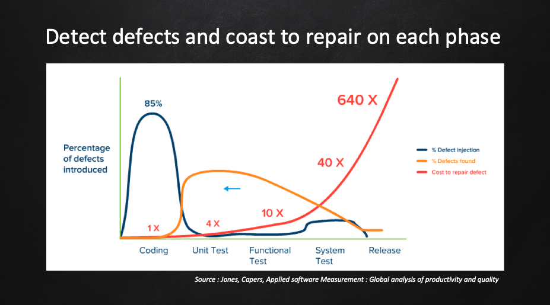

### 개요
항상 버그가 없는 완벽한 코드를 짤 수 있다면 좋겠지만, 버그는 필연적으로 발생하기 때문에 불가능한 일입니다.
새로운 기능을 구현하면서 코드 베이스가 점점 커지고, 그만큼 버그가 발생할 확률도 높아집니다.
코드가 커짐에 따라 버그가 많아지는 건 자연스러운 일이지만 스프린트가 진행될수록 점점 부담이 되게 됩니다.

특히 변경한 코드가 예상치 못한 부분에서 문제를 일으킬 수 있는데, 코드베이스가 커지면 이런 문제는 더 자주 발생하고, 예측하기도 더 어렵습니다.
때문에 QA에서는, “기존 기능들이 문제없이 동작하는지”, “예전에 있었던 이슈가 다시 발생하지는 않는지”를 확인하는 회귀 테스트(Regression Test)를 주기적으로 진행하게 됩니다. 이 단계에서 발견된 버그는 개발자에게 리포트되고 수정 후에 다시 QA를 거칩니다.

이때 버그가 QA 과정에서 발견되는 것과 개발 과정에서 발견되는 것은 시간과 비용이 많은 차이가 납니다. 그래서 발견될 수 있는 문제라면, 개발 과정에서 발견되어야 수정 비용이 줄어듭니다.(shift-left 방식)

1. 개발 과정에서 버그 발생

    개발 → Test Failed → 수정 → QA → 배포

    버그의 원인이 좁혀져서 디버깅하기 쉬움  

2. QA 과정에서 버그 발생 

    개발 → QA → 버그 리포트 → 수정 → QA → 배포

    버그의 원인을 찾기 비교적 어려움
    QA 리소스가 더 소모됨
    배포 시점이 늦어짐

* 목적

개발 단계에서 Ui 자동화 테스트를 수행하여 서비스 품질 향상과 버그 수정비용을 최소화 하는 것을 목적으로 합니다.
단순하고 반복적인 작업을 자동화 함으로써 QA는 창의적인 테스트가 가능하여 품질 향상이 가능합니다.
1. 버그 수정비용 최소화

    개발 단계에서 버그를 식별함에 따라 버그 수정비용을 최소화합니다.

    버그 수정비용이 최소화 되면서 배포 시 병목 현상을 해결합니다.
2. 품질 향상

    Ui 자동화 테스트 커버리지를 점진적으로 확대하여 서비스 품질을 향상시킵니다.

    Chrome 브라우저 뿐만 아니라 Safari, Firefox 등 크로스 브라우징 테스트가 가능합니다.

그 때문에 많은 많은 기업들이 테스트 코드를 작성하고 있습니다.
Ui 자동화 테스트 Tool 중 Selenium을 가장 보편적으로 사용하고 있고 사용하기 편한 Tool 중 하나입니다.
(Selenium은 현재 Netflix, Google, HubSpot, Fitbit 등과 같은 회사에서 사용)

### Selenium 정의
Selenium은 웹 브라우저 자동화에 일반적으로 사용되는 오픈 소스 소프트웨어 프레임워크며 Java, Python, C# 및 Ruby를 포함한 여러 프로그래밍 언어를 지원합니다.
테스트를 자동화함으로써 개발자는 다양한 브라우저와 플랫폼에서 웹 애플리케이션의 기능을 빠르고 효율적으로 확인할 수 있습니다.
Selenium WebDriver는 Selenium 프레임워크에서 가장 널리 사용되는 구성 요소입니다. 다양한 프로그래밍 언어로 자동화 스크립트를 생성하기 위한 프로그래밍 인터페이스를 제공합니다. WebDriver는 웹 브라우저와 직접 상호 작용하여 동작을 제어하고 사용자 작업을 시뮬레이션합니다.

Selenium WebDriver에는 자동화하려는 브라우저에 특정한 드라이버가 필요합니다. 예를 들어 Chrome을 자동화하려면 ChromeDriver를 다운로드하고 구성해야 합니다. 마찬가지로 Firefox를 자동화하려면 GeckoDriver가 필요합니다. 이러한 드라이버는 브라우저와 Selenium WebDriver 사이의 브리지 역할을 하여 통신하고 명령을 실행할 수 있도록 합니다.

* 주의 사항
1. Selenium에 Chromedriver 버전이 UI 자동화 테스트가 실행되는 서버의 Chromedriver 버전과 같아야 합니다.
2. 정적 XPath(XML Path Language) 로 맵핑하게 되면 XPath 값이 HTML 구조가 변경되면 바뀔수 있기 때문에 동적 Xpath(요소의 Class 속성등)으로 구성해야 합니다.

### Selenium Test Coverage

* 적용 서비스

각 프로젝트 별 모든 Front-End 서비스
1. SHIELDrive Web(SHIELDrive 사용자,관리자 페이지)
2. SHIELDGate Web(SHIELDGate 사용자, 관리자 페이지)
3. Security365 Portal Web(관리센터 페이지)
4. SKMS Front Service(DRM 관리자 페이지)
5. cloud-dms-service(SHIELDViewer 관리자 페이지)
6. cloud-oauth-service(Idgp 관리자 페이지)
7. SHIELDInfo Fornt(SHIELDInfo 관리자 페이지)

* 테스트 범위

테스트에 대한 범위가 광범위 하기 때문에 단 기간안에 모든 기능에 대한 테스트 코드 작성은 불가능 합니다.

따라서 아래와 같이 점차적으로 테스트 범위를 확대하는 방향으로 하고자 합니다.

1. 신규 기능 개발 건에 대해서만 테스트 자동화 코드 작성
2. Core한 기능에 대해 적용
3. 전체 범위 적용

### 수행 절차

:::caution 고려사항

* 자동화를 위해 CI Pipeline에 추가(1차 완료)
:::

<table>
  <thead>
    <tr>
      <th>No</th>
      <th>제목</th>
      <th>내용</th>
      <th>비고</th>
    </tr>
  </thead>
  <tbody>
    <tr>
      <td>1</td>
      <td>개발 및 테스트 코드 작성</td>
      <td>우선 신규 기능 개발 건에 대해 Test 자동화 소스 코드 작성</td>
      <td></td>
    </tr>
    <tr>
      <td>2</td>
      <td>개발 검증</td>
      <td>작성된 UI 자동화 테스트를 CI Pipeline을 통해 수행</td>
      <td></td>
    </tr>
    <tr>
      <td>3</td>
      <td>검증 후 조치</td>
      <td>빌드 성공: 스테이징으로 배포   빌드 실패: 실패한 부분 수정 후 재 검증</td>
      <td></td>
    </tr>
    <tr>
      <td>4</td>
      <td>스테이징 환경 검증</td>
      <td>수동 테스트 수행(탐색적 테스트)</td>
      <td></td>
    </tr>
    <tr>
      <td>5</td>
      <td>사내 검증</td>
      <td>전사 테스트 수행</td>
      <td></td>
    </tr>
    <tr>
      <td>6</td>
      <td>퍼블릭 환경 배포</td>
      <td>위 검증 단계에서 버그가 발견되지 않은 서비스 이미지에 대해 퍼블릭 환경에 배포</td>
      <td></td>
    </tr>
  </tbody>
</table>